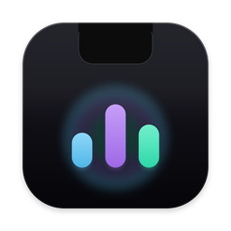

<div align="center">
  

  # TrackPeek

  **A notch-style now-playing player for macOS.**
  Control Spotify and Apple Music without leaving whatever you're doing.

  
  
  
  

</div>

---

TrackPeek lives in your Mac's notch and menu bar. Hover the notch to peek at the current track, control playback, and watch a live equalizer react to the music — all without switching apps. It is not a music client: it remote-controls the Spotify or Apple Music app you already run.

## Features

- **Notch player** — a Dynamic Island-style surface around the MacBook notch: hover to expand into a full mini-player with artwork, progress, and controls.
- **Live equalizer** — bars animate from the actual audio level of the music, with sensitivity settings.
- **Menu bar player** — icon, track title, or artist in the menu bar (configurable), with a compact popover player and optional dedicated prev / play-pause / next buttons.
- **Three popover layouts** — Standard, Compact Horizontal, and Artwork Vertical, previewable in Settings.
- **Adaptive accent colors** — the UI picks up a palette from the current album artwork; the color source is configurable.
- **Spotify & Apple Music** — auto-detects which player is active, or pin a preferred source in Settings.
- **Launch at login** and **automatic updates** via [Sparkle](https://sparkle-project.org).

<!-- Screenshots: add docs/screenshots/*.png and reference them here
<div align="center">
  
  
</div>
-->

## Install

1. Download the latest `TrackPeek-x.y.zip` from [Releases](https://github.com/Komortes/TrackPeek/releases).
2. Unzip and drag `TrackPeek.app` into `/Applications`.
3. First launch: macOS Gatekeeper will warn that the app is from an unidentified developer. **Right-click the app → Open → Open**, or run:

   ```sh
   xattr -dr com.apple.quarantine /Applications/TrackPeek.app
   ```

4. When TrackPeek first talks to Spotify or Apple Music, macOS asks for an **Automation** permission — allow it.

TrackPeek updates itself afterwards via the built-in Sparkle updater.

> **Note:** the app is currently signed with a development certificate, which is why the Gatekeeper step above is needed.

## Build from source

Requirements: macOS 14+, Xcode 15+, [XcodeGen](https://github.com/yonaskolb/XcodeGen) (`brew install xcodegen`).

```sh
git clone git@github.com:Komortes/TrackPeek.git
cd TrackPeek
xcodegen generate          # regenerate TrackPeek.xcodeproj from project.yml
script/build_and_run.sh    # Debug build + launch
```

Run the test suite:

```sh
swift test
```

Cut a release build (bumps the version, zips the app, signs the Sparkle appcast):

```sh
script/release.sh 1.1
```

## How it works

- Playback state and control go through **AppleScript / Apple Events** to the Spotify and Apple Music apps — no Web API, no account login, everything stays local.
- A `PlaybackSourceRouter` picks the active player and falls back per your source preference.
- The equalizer reads the system audio level of the player process via a small Objective-C++ analyzer.
- The notch surface is a borderless `NSPanel` positioned around the physical notch; the rest of the UI is SwiftUI (`MenuBarExtra` + popover).

## Project layout

```
Sources/
  Models/     — playback state, layout & notch configuration
  Services/   — AppleScript clients, source routing, audio monitoring
  Stores/     — observable app state
  Support/    — windowing, Sparkle, launch-at-login, palette extraction
  Views/      — notch player, popover layouts, settings
Tests/        — unit tests (swift test)
```
